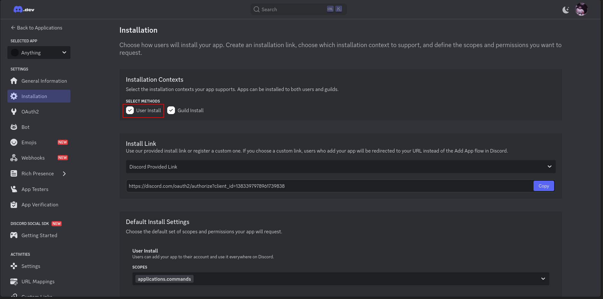
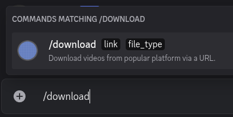

# Discord bot guide
Everything related to setting up your discord bot.
## Token generation
1. Go to [Discord Developer Portal](https://discord.com/developers/applications)
2. Click on 'New Application' and name your bot.

3. Click on 'Bot'

4. Click on 'Reset Token', fill your password and click Copy

## Install your bot into your discord client
1. Go to Installation Tab and ensure that User Install is checked

2. You can copy the 'Install Link' provided and paste it onto your browser URL bar.
    - This will open your discord client automatically.
3. Select Add to My Apps

4. Your discord client should be installed. You can now write `/download` to see your discord bot command.

   - Note: If your slash commands does not appear. Press `Ctrl + R` to reload your discord client.
